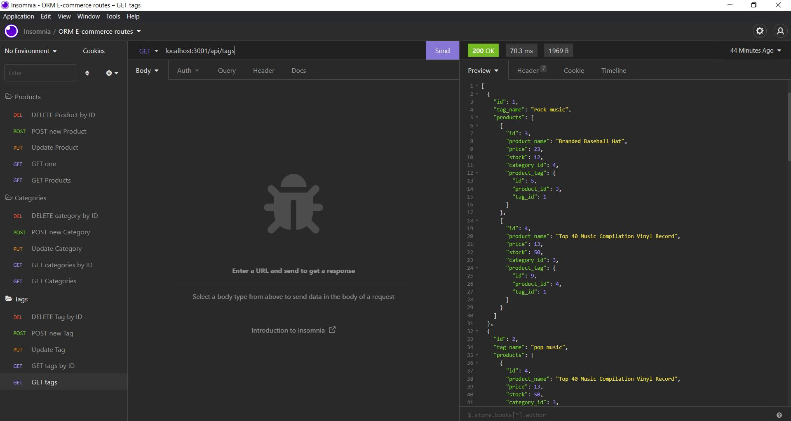

# ORM E-Commerce Back End

## Description
This project uses mysql and Sequelize to create a back-end API for an E-Commerce website.

## Technology Used
- Javascript
- Node.js
- mysql2
- Sequelize
- Express
- dotenv
- Insomnia

## Insomnia Routes
[Demo](https://drive.google.com/file/d/1OrlYONm8pV9EH3P33FDdgKt5kyC4w3hi/view)


## Installation/Use
1. Clone project to your local machine.
2. Install necessary node packages and dependencies by typing ```npm install``` at the command line in the root of the project folder.
3. At the command line, enter ```mysql -u root -p``` to open MySQL shell. Source the database, schema, and seed the data in the MySQL shell by entering the following commands:
* ```source db/db.sql```
* ```source db/schema.sql```
* ```source db/seeds.sql```
4. Exit MySQL shell and return to the terminal. Enter ```npm start``` to start the server. Use Insomnia or Postman to view routes.

## Made with 💖 by Erin Knapp 2022